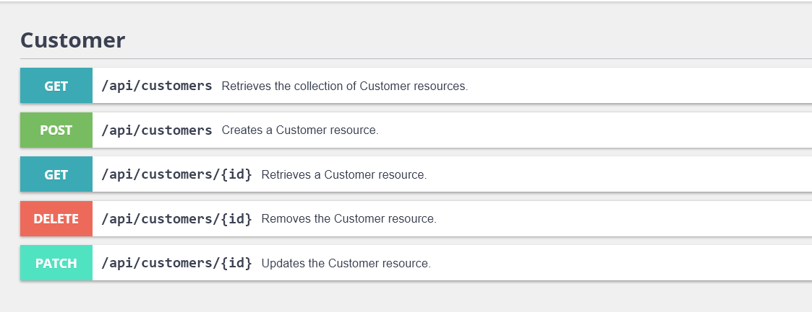

# claim-crud-api
## Technical Case for JSON based CRUD API [Cloud Insurance]
### Case study

Develop a simple JSON based CRUD API provider for Claim handling in such a way, that it is
easy to extend in the future.
The application should handle Customer and Bank Account entities. Please note, that a
Customer can have multiple Bank Accounts, but only one can be preferred out of them at any
given time. The entities should be designed by you. We have provided below the minimum
requirements related to them. You can pick any database based on your liking. Please include
data validation in your solution.
Data Schema
The Bank Account have the include the following fields:
- Account Number - 11 character string
  - use the MOD11 algorithm to validate
- Account Type - enum [ORGANIZATION, PRIVATE]
- Account Name - string, display name to identify the account
- Currency - ISO 4217 defined currency code
The Customer contains at least the following fields:
- Name - string
- SSN - string (Social security number used as the unique identifier)

### Overview

We would prefer the solutions to be made with Doctrine ORM, but you are free to choose
whatever frameworks/libraries you find useful. We will consider the following aspects of your
solution:
- Functionality and correctness
- Usage of architectural patterns
- Code quality and libraries used
- Included tests and code testability
- Code organization and style
- Documentation

---

## Results

Use this commands to start project:

    $ composer install
    $ symfony server:start -d
    $ docker-compose up -d
 
Url of interface: <a href="/api">api</a>

